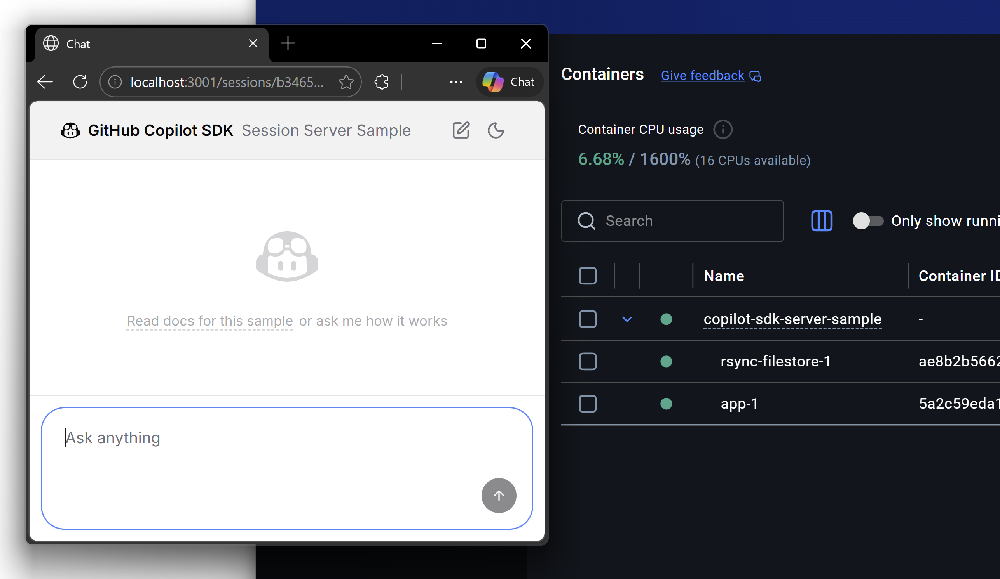
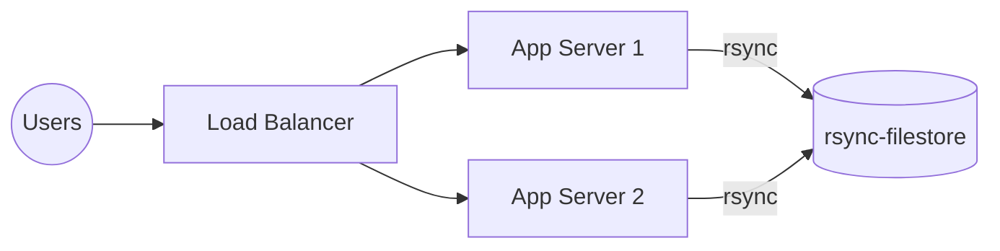

# GitHub Copilot SDK — Session Server Sample

A sample app demonstrating one possible way to build a multi-user, server-hosted agent chat experience. This is built using [GitHub Copilot SDK](https://github.com/github/copilot-sdk), so it can complete challenging real-world tasks using the same proven harness that powers Copilot CLI.

In this sample, each user gets an isolated session with its own virtual filesystem and sandboxed bash runtime, all managed server-side.



The agent can manage its own files, write and execute Python code, and use `curl` to access only pre-approved web resources.

⚠️ This is a sample to demonstrate a possible app architecture. It's not an app you could deploy as-is, since it lacks important security features such as auth, and the filesystem isolation is limited. See [limitations](#limitations) for more details.

## Running the sample

You need a GitHub token (a fine-grained PAT with no special permissions, or the output of `gh auth token`). This token is used by Copilot SDK to perform AI inferencing using a model approved for your account.

```bash
# On Bash (macOS/Linux)
GITHUB_TOKEN=<your-token> docker compose build --no-cache
GITHUB_TOKEN=<your-token> docker compose up

# On PowerShell (Windows)
$env:GITHUB_TOKEN="<your-token>"
docker compose build --no-cache
docker compose up
```

When it's running, open [http://localhost:3001](http://localhost:3001).

### In-memory mode

By default, each session's virtual filesystem (VFS) is backed by disk. You can see and edit all the virtual filesystems inside `app/sessions`.

To use a purely in-memory virtual filesystem instead, set an environment variable `USE_IN_MEMORY_VFS` to `true` and re-run `docker compose up`.

In realistic server deployments it would be better to use disk rather than in-memory storage, because disk space is more cheaply available. But if you're building a client-side application that creates large numbers of short-lived agent sessions, it might work well to use an in-memory VFS.

## Architecture



### Per-session isolation

When a user connects, the app server creates an isolated session with:

- A **Copilot SDK session** (`CopilotSession`) that maintains conversation state, tool handlers, and event streaming.
  - We limit it to using tools that are intended to be safe in multi-user environments because they don't read/write files.
  - The session's only tool that can operate on disk is `bash`, but this is swapped out for a sandboxed version (see below).
- A **virtual filesystem** (in-memory or disk-backed) scoped to that session. The Copilot agent reads and writes files within this filesystem only. It cannot see the server's disk or the state of other sessions.
- A **sandboxed bash runtime** ([just-bash](https://github.com/aspect-build/just-bash)) attached to the virtual filesystem, exposed to the agent as a tool. Network access is restricted to a small allowlist.

Multiple browser tabs can observe the same session simultaneously — the server maintains a single `CopilotSession` per session ID and fans out events to all connected WebSockets. To see this, copy and paste your session URL into a second browser window or tab.

### Scaling across multiple app servers

The architecture supports running multiple app server instances behind a load balancer:

- **Session files are synced to a shared filestore.** After each agent turn completes, the app server pushes the session's directory to the `rsync-filestore` container using rsync. This is incremental and efficient.
- **Sessions can be resumed on any server.** When a user reconnects (possibly to a different app server), the server restores the session files from the filestore before resuming the Copilot session.
- **App servers clean up local storage.** Once all WebSocket connections for a session close, the app server deletes the local copy. This keeps each server's disk usage bounded.

The `rsync-filestore` container is a minimal Alpine image running an rsync daemon. It serves as the persistent, shared store that survives app server restarts and enables session mobility across servers.

**This is just one possible example of how to balance performance and resilience to server recycling.** Other strategies are also possible, because the storage virtualization APIs in Copilot SDK allow you to store things anywhere you like. For example you could directly stream session events to an event store rather than letting them be written to disk in the first place. But for this example, simply synchronizing and restoring the session's entire VFS is a simple and comprehensive solution.

## Code structure

 * `app`: the application server. You could run many instances and load balance over them.
   * `api`: server-side code that defines and manages agent sessions
     * `chatSocket.ts`: starts a WebSocket listener. As clients connect/disconnect, starts and stops `CopilotSession` instances and synchronizes storage to `rsync-filestore`
     * `storage/`: simple VFS implementations
     * `bash.ts`: swaps out Copilot SDK's built-in shell tool with one backed by [just-bash](https://github.com/vercel-labs/just-bash). This is simply an example - you could instead map it into a per-session container, any other isolated shell. Various other open source projects provide isolated shells.
   * `web-ui`: an Express+React application providing the user interface
     * `hooks/useChat.ts`: opens the websocket connection to `api/chat` and uses a reducer pattern to convert the event stream into a UI
     * everything else: generic chat UI (a lot of code but nothing interesting)
 * `rsync-filestore`: a minimal `rsync` server that provides persistent storage shared by all application servers

## Limitations

> **⚠️ GitHub Copilot SDK is under active development and patterns for multi-user deployment are still evolving.**

This example illustrates many useful ideas, but isn't something you can deploy as-is, because:

- **Filesystem isolation is incomplete.** The Copilot SDK runtime writes some workspace files (e.g., checkpoints, plan files) to the server's native filesystem outside the virtual filesystem. These are not yet fully contained within the per-session sandbox. We're actively working on completing this.
- **No authentication.** The sample has no user authentication or session authorization. Anyone with access to the server can create or resume sessions.
- **Not production-hardened.** Error handling, rate limiting, and resource quotas are minimal. This is a reference implementation to illustrate the architecture, not a production-ready service.

## License

This project is licensed under the terms of the MIT open source license. Please refer to the [LICENSE](./LICENSE) file for the full terms.

## Support

This project is a sample/reference implementation. Please use [GitHub Issues](https://github.com/github/copilot-sdk/issues) to report bugs or request features in Copilot SDK itself.

## Contributing

We're not looking for contributions into this sample, since we aim to keep it simple and minimal. However we are very happy to consider contributions to [Copilot SDK](https://github.com/github/copilot-sdk).

This project adheres to a [Code of Conduct](./CODE_OF_CONDUCT.md). By participating, you are expected to uphold this code.
